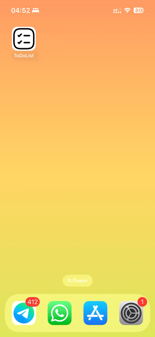

## Тестовое задание iOS

### Задача:
Необходимо разработать простое приложение для ведения списка дел (ToDoList) с возможностью добавления, редактирования, удаления задач.

Требования:
1. Список задач:
- Отображение списка задач на главном экране.
- Задача должна содержать название, описание, дату создания и статус (выполнена/не выполнена).
- Возможность добавления новой задачи.
- Возможность редактирования существующей задачи.
- Возможность удаления задачи.
- Возможность поиска по задачам.

2. Загрузка списка задач из dummyjson api: https://dummyjson.com/todos. При первом
запуске приложение должно загрузить список задач из указанного json api.

3. Многопоточность:
- Обработка создания, загрузки, редактирования, удаления и поиска задач должна
выполняться в фоновом потоке с использованием GCD или NSOperation.
- Интерфейс не должен блокироваться при выполнении операций.

4. CoreData:
- Данные о задачах должны сохраняться в CoreData.
- Приложение должно корректно восстанавливать данные при повторном запуске.

5. Используйте систему контроля версий GIT для разработки.

6. Напишите юнит-тесты для основных компонентов приложения

7. Необходимо убедиться, что проект открывается на Xcode 15

Будет бонусом:
8. Архитектура VIPER: Приложение должно быть построено с использованием архитектуры VIPER. Каждый модуль должен быть четко разделен на компоненты: View, Interactor, Presenter, Entity, Router.

  

Технологии:
- Swift
- Архитектура VIPER
- UIKit
- Верстка кодом
- CoreData
- Unit-тесты

### Инструкция для работы с приложением:

- Скрытие клавиатуру: Нажмите на верхнюю область экрана.
- Перевод задачи в статус выполнения: Нажмите на кружок с обводкой рядом с задачей.
- Удаление задачи: Используйте свайп влево или удерживайте задачу, чтобы выбрать опцию удаления.
- Редактирование задачи: Однократно нажмите на задачу или удерживайте её, чтобы выбрать опцию редактирования.
- Создание новой задачи: Нажмите на кнопку в правом нижнем углу экрана.
- Сохранение задачи: Происходит автоматически после нажатия кнопки "Назад".

